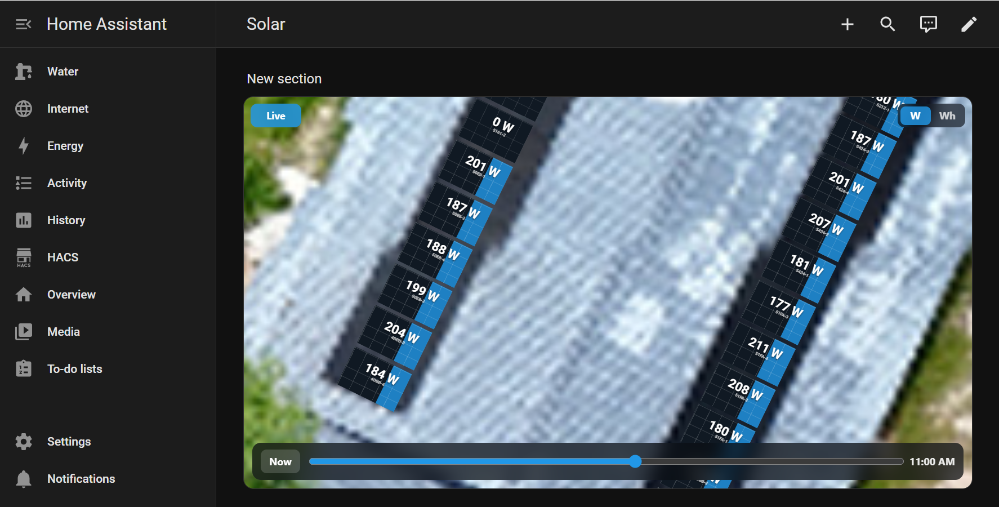

# Hoymiles for Home Assistant

This repository is a fork of [suaveolent/ha-hoymiles-wifi](https://github.com/suaveolent/ha-hoymiles-wifi). The original Home Assistant integration and parts of the original README text were written by [suaveolent](https://github.com/suaveolent).

The integration connects Hoymiles DTUs, HMS/HMT microinverters, and hybrid inverters to Home Assistant with live local data. It uses the [hoymiles-wifi](https://github.com/suaveolent/hoymiles-wifi) Python library to communicate directly with the devices on your local network, with no Hoymiles cloud connection required.

This fork keeps the original local communication model and adds changes focused on larger Home Assistant installations: multi-DTU ownership handling, shared meter data, serial-based device names, layout metadata, a Lovelace layout map, and native table cards.

> [!NOTE]
> This project is not affiliated with Hoymiles. Hoymiles trademarks and product names belong to their respective owners.

## Changes Made in This Fork

This fork keeps the upstream Hoymiles integration behavior, but adds several features for larger multi-DTU and multi-inverter installations.

### Meter Type Override

The setup and reconfigure flow includes a `Meter type` option:

- `Auto-detect`: keep the meter type reported by the DTU.
- `Single-phase`: force detected meters to single-phase.
- `Three-phase`: force detected meters to three-phase.

This is useful when a DTU reports a shared three-phase meter as single-phase even though the response contains phase B/C values.

When a meter is configured as three-phase, the Home Assistant device model is shown as `DTSU666`. Single-phase meters are shown as `DDSU666`.

### Shared Meter Handling

When adding or reconfiguring a DTU, detected meters are skipped automatically if another Hoymiles config entry already has the same meter serial number.

This avoids creating duplicate meter entities for installations where several DTUs report the same physical meter. The first configured DTU keeps the meter; later DTUs still add their inverter and panel entities, but do not add duplicate meter entities.

Meter runtime data is shared globally by meter serial number. Every DTU still polls only at its own configured update interval, but each poll response can update the shared meter store. Meter entities read from that shared store, so a DTU that reports live power but omits cumulative energy totals no longer clears the totals from another DTU.

Energy counters are accepted only when the new value is greater than or equal to the last accepted value. Missing energy fields are ignored. If any present energy counter in a DTU meter sample moves backward, the whole meter sample is treated as stale and none of its values are merged. Complete meter energy samples are also checked for internal consistency: exported energy must match the exported phase sum, and imported energy must match the consumed phase sum within the configured `Meter energy consistency tolerance`. The default tolerance is `1000` raw meter units. Instantaneous values such as power, voltage, current, power factor, and fault code otherwise use the newest DTU sample.

The meter device is shown as a standalone Hoymiles device, not as a child of one DTU. A diagnostic sensor, `Meter last source DTU`, shows which DTU last supplied an accepted shared meter update and includes source metadata in its attributes.

If the meter should be moved to another DTU, remove the meter device from the current DTU entry in Home Assistant first. The integration removes that meter from the stored config entry data, allowing another DTU to claim it during reconfigure.

### Real-Data Startup Staggering

Real-data polling can be delayed at Home Assistant startup or integration reload with the `Startup cooldown (seconds)` config option. Existing entries that do not have this value stored use the default of `120` seconds.

After the startup cooldown, DTU real-data polls are staggered evenly across the configured update interval. For example, four DTUs with a 300 second update interval poll about 75 seconds apart, while each individual DTU still waits 300 seconds between its own real-data requests.

This reduces startup bursts and gives shared meter data more frequent combined updates without polling any single DTU more often than its configured interval. Config and app-info refreshes are not staggered by this setting.

### Inverter Ownership Moves Between DTUs

When adding or reconfiguring a DTU, detected inverters are automatically claimed by that DTU. If another Hoymiles config entry still has the same inverter serial number stored, the inverter and its port data are removed from the old entry and that entry is reloaded.

This handles physical inverter moves between DTUs without requiring a precise reconfigure order. Reconfigure whichever DTU currently detects the moved inverter; that DTU becomes the owner in Home Assistant. Shared meters are not affected by this behavior.

### Serial-Based Device Names

Hoymiles devices now use serial-based default names:

- `DTU <serial>`
- `Inverter <serial>`
- `Meter <serial>`
- `Hybrid inverter <serial>`

For newly created devices, this should also make generated entity IDs easier to identify, for example `sensor.inverter_1421a01a4525_ac_current` instead of `sensor.inverter_ac_current_12`.

Existing Home Assistant device and entity registry entries may keep their current names because Home Assistant stores registry names separately.

### Layout Metadata Entities

The Reconfigure flow can store optional site metadata:

- `layout_json`: the Hoymiles cloud `v3_g_c` layout JSON.
- `dtu_location`: a text location for the DTU config entry.
- `inverter_phase_map`: one `serial=phase` line per inverter. Phases `1`, `2`, `3`, `L1`, `L2`, and `L3` are accepted.

When metadata is configured, the integration creates diagnostic sensors attached to the existing Hoymiles devices:

- `sensor.inverter_<serial>_location`
- `sensor.inverter_<serial>_phase`
- `sensor.dtu_<serial>_location`

Inverter locations are derived from Hoymiles layout group names. Row suffixes are stripped, so groups like `53-a` and `53-b` both become location `53`. Empty metadata fields do not create metadata entities.

### Noisy Diagnostics Disabled by Default

Some diagnostic entities are disabled by default because they are often useless or report `unknown`:

- inverter warning number
- inverter port error code
- inverter hardware version
- inverter software version

They can still be enabled manually from the Home Assistant entity registry if needed for troubleshooting.

### Clearer Meter Energy Names

The meter energy counters use clearer Home Assistant display names:

- `meter_energy_total_consumed`: shown as `Energy imported`
- `meter_energy_total_power`: shown as `Energy exported`

The underlying Hoymiles data keys and Home Assistant entity unique IDs are unchanged.

### Home Assistant Energy Dashboard

For a setup where the Hoymiles meter reports signed grid power and negative power means export, the Home Assistant Energy Dashboard can be configured like this. Replace the example serial placeholders with the actual entity IDs from your Home Assistant entity registry:

- Solar production energy: `sensor.dtu_<serial>_ac_daily_energy`
- Solar production power: `sensor.dtu_<serial>_ac_power`
- Energy imported from grid: `sensor.meter_<serial>_energy_imported`
- Energy exported to grid: `sensor.meter_<serial>_energy_exported`
- Type of power measurement: `INVERTED`
- Power measurement: `sensor.meter_<serial>_phase_total_power`

Home Assistant may create an inverted helper entity from that power measurement setup.

## Supported Devices

The custom component was successfully tested with:

- Hoymiles HMS-400W-1T
- Hoymiles HMS-800W-2T
- Hoymiles HMS-1000W-2T
- Hoymiles HMS-2000D-4T
- Hoymiles HMS-2000DW-4T
- Hoymiles HMT-2000-4T
- Hoymiles DTU-WLite
- Hoymiles DTU-Pro (S)
- Hoymiles HAS-5.0LV-EUG1
- Hoymiles HYS-4.6LV-EUG1
- Hoymiles HYT-5.0HV-EUG1
- Hoymiles HAT-8.0HV-EUG1
- Solenso H-1000 (not tested for command, only to get data)
- Solenso DTU_SLS (not tested for command, only to get data)

## Warning

> [!CAUTION]
> Please refrain from using the current power limitation feature for zero feed-in, as it may lead to damaging the inverter due to excessive writes to the EEPROM.

## Installation

1. Open the [HACS](https://hacs.xyz) panel in your Home Assistant frontend.

2. Navigate to the "Integrations" tab.

3. Click the three dots in the top-right corner and select "Custom Repositories."

4. Add a new custom repository:

- **URL:** `https://github.com/hmsta/ha-hoymiles-wifi`

- **Category:** Integration

5. Click "Add"

6. Click on the `Hoymiles` integration.

7. Click "DOWNLOAD"

8. Navigate to "Settings" - "Devices & Services"

9. Click "ADD INTEGRATION" and select the `Hoymiles` integration.

10. Enter the DTU or inverter host name/IP address in the `Host` field and click `SUBMIT`.

> [!NOTE]
> Home Assistant should install the pinned `hoymiles-wifi` Python requirement from the integration manifest. If that fails in your environment, use the Docker workaround below or install the dependency manually.

### Option 2: Manual Installation

1. Download the contents of this repository as a ZIP file.

2. Extract the ZIP file.

3. Copy the entire `custom_components/hoymiles_wifi` directory to your Home Assistant `custom_components` directory.

4. Restart your Home Assistant instance to install the integration requirement and apply the changes.

### Docker Users: Workaround for HTTP 500 Error

If you encounter an HTTP 500 error when adding the integration in a Home Assistant Docker container, follow this workaround:

1. Create a new Docker image for Home Assistant with the `hoymiles-wifi` library pre-installed:
   ```dockerfile
   FROM homeassistant/home-assistant
   RUN pip install hoymiles-wifi
   ```
2. Build the new Docker image:
   ```bash
   docker build -t ha-hoymiles .
   ```
3. Switch to this newly built image when running Home Assistant.

## Configuration

Configuration is done in the UI.

1. `Host`: Enter the IP address or the hostname of your inverter or DTU.

> [!NOTE]
> To find the IP address or hostname of your inverter/DTU, you can either access your router’s web interface to view connected devices, or use a network scanning tool (such as Fing or Angry IP Scanner) to identify the device on your local network.

2. `Update interval (seconds)`: This defines how frequently the system will request data from the inverter or DTU. Enter the desired time in seconds.

> [!NOTE]
> Setting the update interval below approximately 32 seconds (120 seconds for newer firmware versions) may disable Hoymiles cloud functionality. To ensure proper communication with Hoymiles servers, keep the update interval at or above this threshold.

3. `Meter energy consistency tolerance`: Maximum allowed difference between a meter total energy counter and the sum of its phase energy counters before the whole meter sample from that DTU poll is rejected. The default is `1000` raw meter units.

### Optional Reconfigure Metadata

After the DTU is configured, use Reconfigure to add optional metadata used by the layout map and table cards:

- `Hoymiles layout JSON`: paste the full Hoymiles cloud `v3_g_c` layout JSON.
- `DTU location`: a short location label for this DTU.
- `Inverter phase map`: one inverter phase mapping per line.

Phase map example:

```text
1421a01a4ff5=1
1421a01a5294=L2
1421a01a53da=3
```

Serial numbers are normalized to lowercase. Reconfiguring with an empty metadata field removes the corresponding generated metadata entities after reload.

## Hoymiles Layout Card

This fork includes a Lovelace custom card for rendering the Hoymiles cloud layout JSON on top of the cloud background image.

The integration auto-registers the frontend resources with a cache-busted URL. If your Home Assistant setup does not pick them up automatically, add the dashboard resources manually:

```yaml
url: /hoymiles_wifi_static/hoymiles-layout-card.js
type: module
```

```yaml
url: /hoymiles_wifi_static/hoymiles-table-cards.js
type: module
```

The preferred setup is to store `layout_json` in the integration Reconfigure flow, then use a compact card config:

```yaml
type: custom:hoymiles-layout-card
max_watts: 300
off_threshold_watts: 1
height: 80vh
min_height: 520px
initial_zoom: 1
max_zoom: 30
panel_text_min_size: 30
replay_step_seconds: 3600
replay_start_hour: "06:00"
replay_end_hour: "19:00"
signal_anchor_port: 3
rssi_ok_dbm: -75
rssi_bad_dbm: -90
```

If you have more than one Hoymiles config entry with stored layout JSON, add `entry_id` to select the entry:

```yaml
type: custom:hoymiles-layout-card
entry_id: your_config_entry_id
```

For debugging or one-off layouts, a pasted `layout:` value is still supported and takes precedence over the stored Reconfigure layout.

The card does not expose one selector per panel. It reads the panel positions from the Hoymiles JSON and automatically matches integration entities named like:

- `sensor.inverter_1421a01a4ff5_port_1_dc_power`
- `sensor.inverter_1421a01a4ff5_port_1_dc_daily_energy`
- `sensor.inverter_1421a01a4ff5_signal_strength`

Hoymiles serial numbers from the layout JSON are lowercased before building these entity IDs.

Use the `RSSI`/`W`/`Wh` buttons on the card to switch between inverter signal strength, current DC power, and daily DC energy. Values are rounded to whole digits. In `RSSI` mode, panels are hidden and one signal marker is shown per inverter at `signal_anchor_port` (`3` by default). If `rssi_ok_dbm` and `rssi_bad_dbm` are both set, signal icons are green at or above `rssi_ok_dbm`, orange between the thresholds, and red at or below `rssi_bad_dbm`; missing, unavailable, or non-negative RSSI values are treated as offline/gray. Without valid thresholds the card keeps its default signal coloring. In `W` mode, panel fill uses `max_watts` as the 100% reference. In `Wh` mode, panel fill uses the highest visible panel daily-energy value as the 100% reference, ignoring values below `off_threshold_watts` so ghost production stays dark/off.

Set `height` to override the default aspect-ratio sizing, for example `height: 80vh` or `height: calc(100dvh - 120px)` for a phone dashboard. The aliases `map_height` and `card_height` are also accepted. Set `initial_zoom` for the starting zoom and `max_zoom` to allow deeper pinch/wheel zoom; the defaults are `1` and `15`. Set `panel_text_min_size` to control the rendered panel size where values and serial labels start showing; lower values show text sooner, and the default is `30`.

The `Replay` button switches the `W` view from live values to Home Assistant history for the current day. History is loaded only when replay is opened, compressed to hourly samples by default, and cached in the browser. The default replay window is 06:00-19:00. Set `show_replay_control: false` to hide the button, adjust `replay_step_seconds` for finer/coarser jumps, or set `replay_start_hour` / `replay_end_hour` to change the daily window. Replay hours accept values like `6`, `"06:00"`, or `"6am"`.

## Hoymiles Table Cards

This fork also includes native Lovelace table cards so large installations do not need custom scripts, generated YAML maps, or `custom:flex-table-card` dashboards.

```yaml
type: custom:hoymiles-inverter-card
```

```yaml
type: custom:hoymiles-panels-card
```

```yaml
type: custom:hoymiles-dtu-card
```

The table cards read directly from `hass.states`. They discover Hoymiles entities by the integration's serial-based entity IDs and use the metadata sensors from Reconfigure for location and phase filters.

Available table features:

- search
- location and phase filters
- state/status filters
- sortable columns
- page size selector
- pagination
- mobile-friendly stacked rows
- click a row to open the Home Assistant entity more-info dialog

Default inverter columns are inverter, location, phase, state, AC power, AC current, temperature, and RSSI. Default panel columns are inverter, location, phase, port, DC power, DC voltage, DC current, and daily energy. Default DTU columns are DTU, location, status, IP, power, and daily energy.

Columns can be customized with short suffix names:

```yaml
type: custom:hoymiles-panels-card
columns:
  - inverter
  - location
  - phase
  - port
  - dc_power
  - dc_daily_energy
page_size: 50
production_status: all
```

## Screenshots




## Caution

This is a custom integration that communicates directly with inverter and DTU endpoints. Test changes carefully, especially write/control features.

## Known Limitations

> [!NOTE]
> **Update Frequency:** The library may experience limitations in fetching updates, potentially around twice per minute. The inverter firmware may enforce a mandatory wait period of approximately 30 seconds between requests.
> This issue can be identified when the data returned matches the response from the previous request.
> If you encounter this, you can try the _experimental_ performance data mode. (Needs to be enabled on each reboot of the DTU.)

## Attribution

This project was generated from [@oncleben31](https://github.com/oncleben31)'s [Home Assistant Custom Component Cookiecutter](https://github.com/oncleben31/cookiecutter-homeassistant-custom-component) template.
